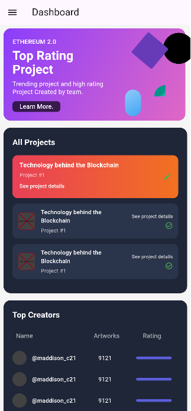
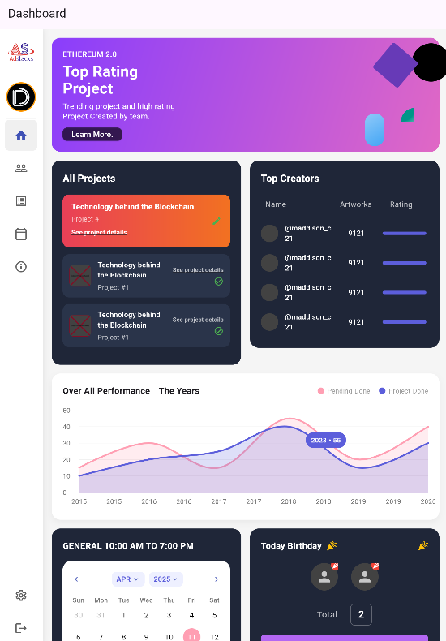
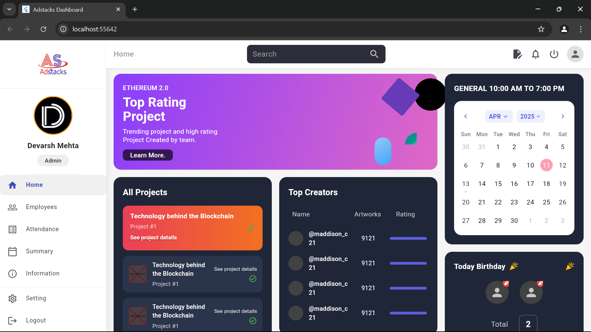

# 📊 Flutter Responsive Dashboard Assignment

This is a fully responsive Flutter Dashboard designed to work seamlessly across **Mobile**, **Tablet**, and **Web** screens. The assignment was completed as part of a task submission and demonstrates a solid grasp of layout design, responsiveness, and Flutter best practices.

## ✅ Assignment Status: Completed

---

## 👨‍💻 Developed by

**Devarsh Mehta**

- 🔗 [GitHub](https://github.com/Devarsh-42)
- 🌐 [Portfolio](https://devarshmehta.netlify.app/)
- 💼 [LinkedIn](https://www.linkedin.com/in/devarsh-mehta-6670581b8/)

---


## 🖼 Screenshots


| Mobile View | Tablet View | Web View |
|-------------|-------------|----------|
|  |  |  |

---

## 🚀 Features

- ✅ Responsive UI using MediaQuery.
- ✅ Side navigation bar and top app bar for navigation.
- ✅ Dashboard cards with charts, stats, and dynamic layout.
- ✅ Clean, scalable code architecture using widgets.
- ✅ Dark/light theme compatibility (optional enhancement).

---

## 🛠️ Tech Stack

- **Flutter** - Frontend Framework
- **Dart** - Programming Language
- **Material Design** - UI Components

---

## 📥 Getting Started

To run this project locally, follow these steps:

```bash
# 1. Clone the repository
git clone https://github.com/Devarsh-42/Adstacks-Dashboard

# 2. Navigate to the project directory
cd adstacks

# 3. Install dependencies
flutter pub get

# 4. Run the application
flutter run -d chrome        # For web
flutter run -d emulator      # For Android/iOS
